# System Architecture and Data Flow Documentation

## High-Level System Architecture

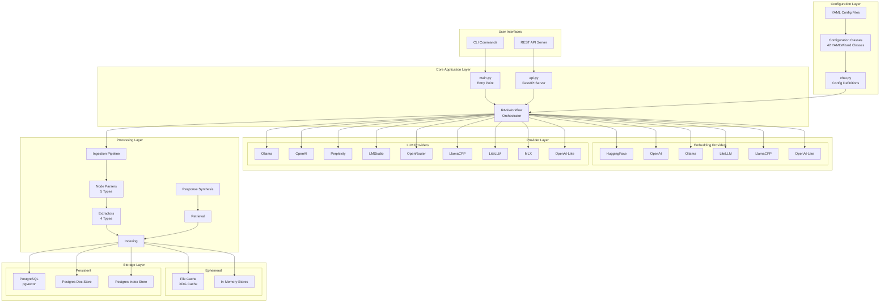

## Data Flow Through RAG Pipeline

### 1. Document Indexing Flow

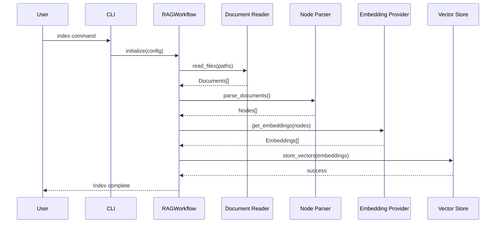

### 2. Query Processing Flow

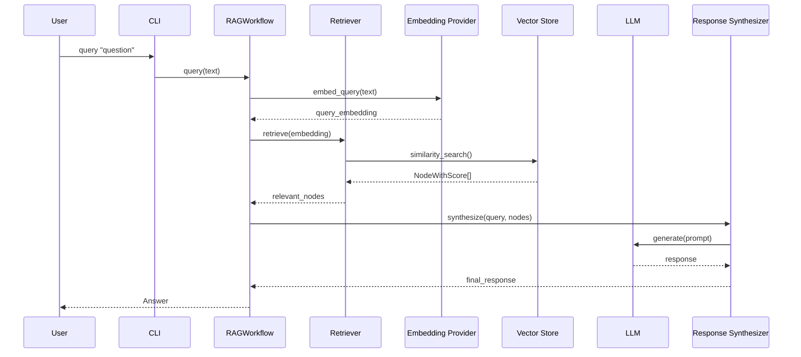

### 3. Chat Interaction Flow

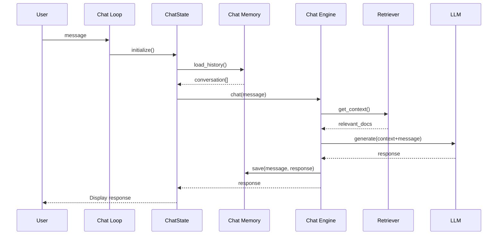

## Component Interaction Diagram

```mermaid
graph LR
    subgraph "Configuration Management"
        YW[YAMLWizard Base]
        EC[Embedding Configs<br/>6 Types]
        LC[LLM Configs<br/>9 Types]
        SC[Splitter Configs<br/>5 Types]
        EXC[Extractor Configs<br/>4 Types]
        QC[Query Configs<br/>7 Types]
        CC[Chat Configs<br/>4 Types]
        
        YW --> EC & LC & SC & EXC & QC & CC
    end
    
    subgraph "Provider Factory"
        PF[Provider Factory<br/>__load_component()]
        EP[Embedding Providers]
        LP[LLM Providers]
        
        EC --> PF
        LC --> PF
        PF --> EP
        PF --> LP
    end
    
    subgraph "Core Workflow"
        RW[RAGWorkflow]
        QS[QueryState]
        CS[ChatState]
        
        RW --> QS
        RW --> CS
        EP --> RW
        LP --> RW
    end
```

## Storage Layer Architecture

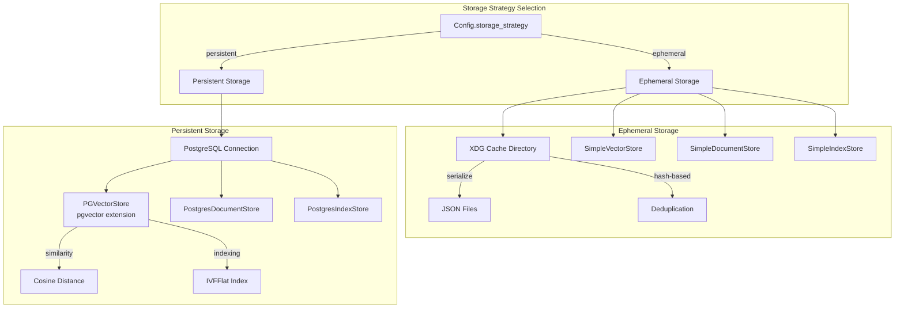

## Main Workflow Sequence Diagrams

### Index Command Workflow

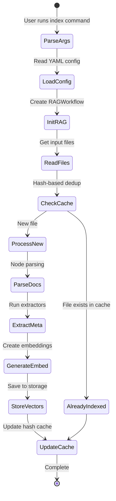

### API Server Request Flow

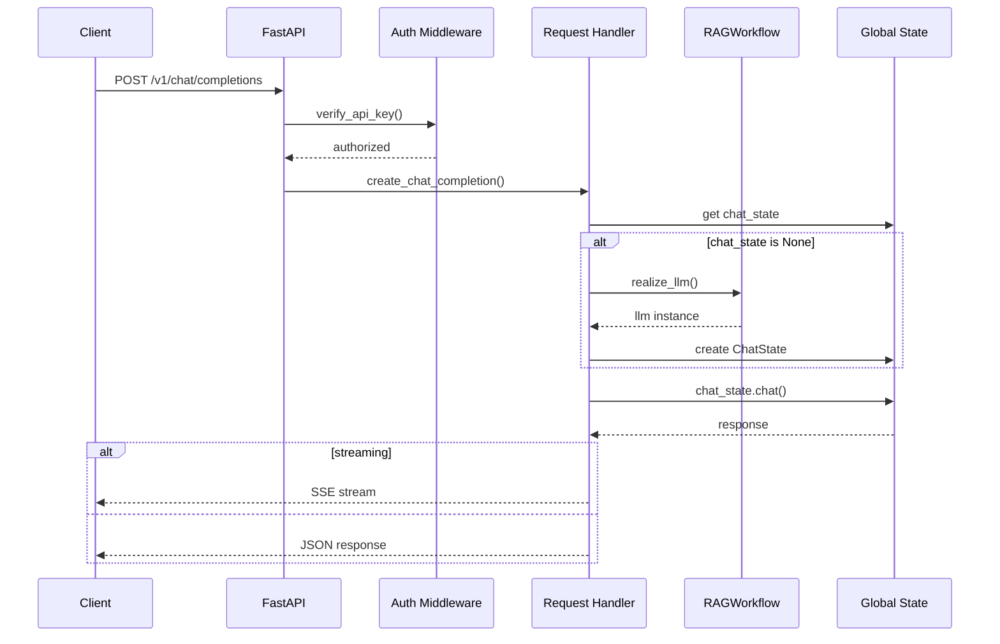

## Class Hierarchy and Relationships

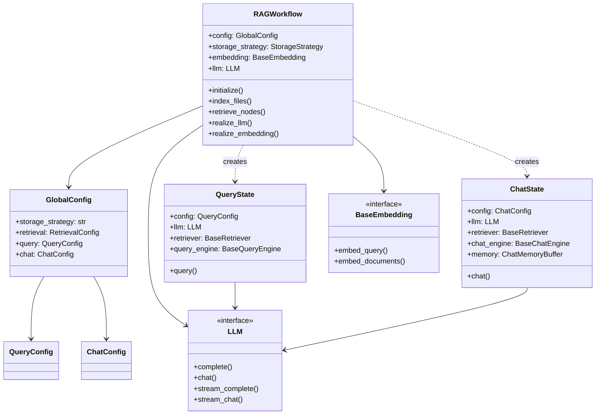

## Provider Initialization Pattern

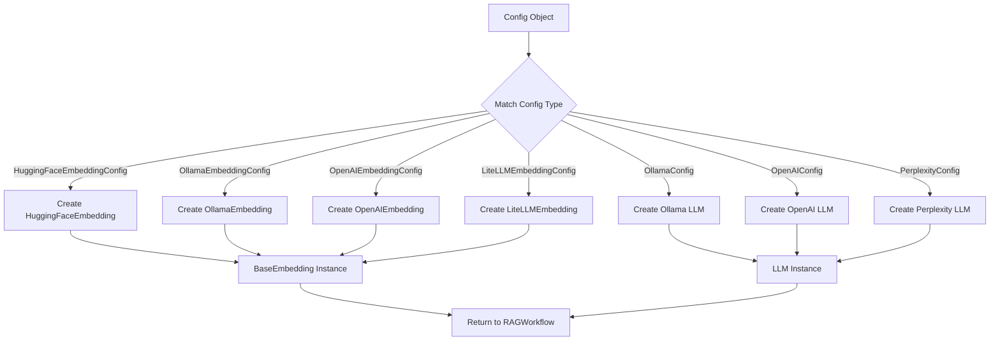

## Error Handling Flow

```mermaid
flowchart TD
    A[User Action] --> B{Command Type}
    B -->|CLI| C[Try Command Execution]
    B -->|API| D[Try API Handler]
    
    C --> E{Success?}
    E -->|Yes| F[Return Result]
    E -->|No| G[error() function]
    G --> H[Print to stderr]
    H --> I[sys.exit(1)]
    
    D --> J{Success?}
    J -->|Yes| K[Return Response]
    J -->|No| L[HTTPException]
    L --> M[Status Code + Detail]
    M --> N[JSON Error Response]
```

## Performance Optimization Points

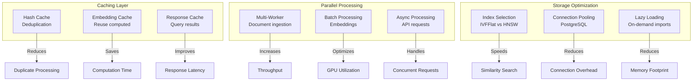

## Refactoring Opportunities

Based on the architecture analysis, key refactoring opportunities:

1. **Extract Provider Factory**: Centralize provider initialization logic
2. **Split RAGWorkflow**: Separate concerns into focused classes
3. **Abstract Configuration**: Create base classes for common config patterns
4. **Standardize Error Handling**: Implement consistent exception hierarchy
5. **Modularize Storage**: Create storage adapter interface
6. **Optimize Imports**: Implement lazy loading for heavy dependencies
7. **Simplify State Management**: Extract state management to dedicated classes
8. **Create Plugin System**: Enable dynamic provider registration

## Deployment Architecture

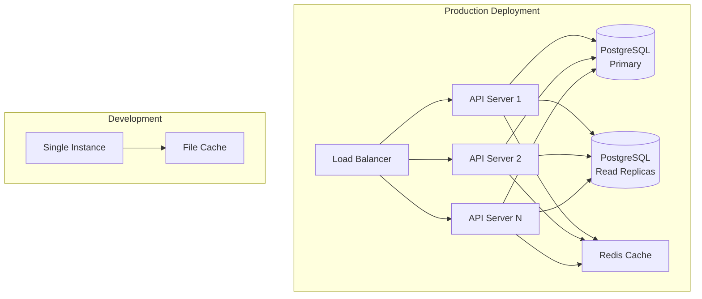

This architectural documentation provides a comprehensive view of the rag-client system, showing all major components, their interactions, data flows, and deployment patterns.